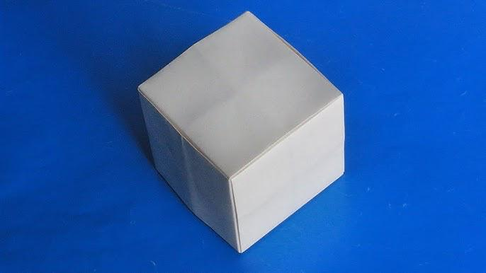
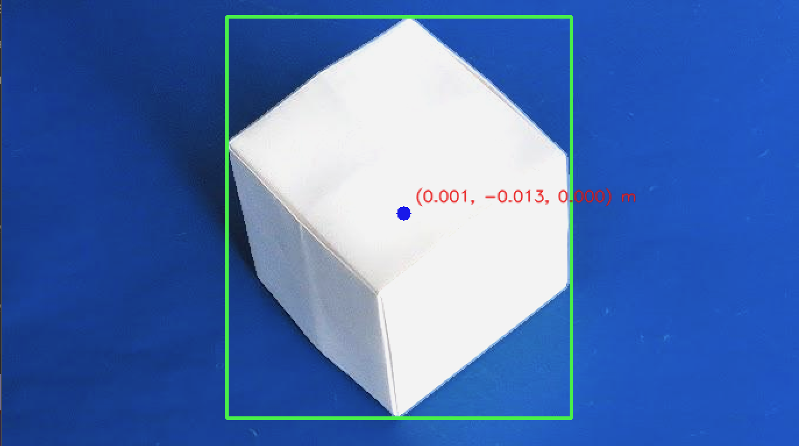

# CV Pipeline — Test Guide

> Перевірка пайплайну комп'ютерного зору для детекції куба і оцінки його 3D-позиції на плоскій поверхні.

---

Тест демонструє роботу CV-пайплайну: виявлення куба і оцінка його 3D-позиції на плоскій поверхні.

На вхід подається одне зображення. На виході:

- `target_found` — чи знайдено куб
- `bbox` — обмежувальний прямокутник у пікселях
- `world_coords` — розрахункові координати `(X, Y, Z)` у метрах
- Дебаг-зображення з накладеними результатами

---

## Запуск

З кореневої директорії проєкту:

```bash
python -m src.test_cv
```

**Вимоги:**

- Python ≥ 3.9
- Встановлені пакети: `numpy`, `opencv-python`
- Тестове зображення присутнє за шляхом: `assets/photo_2026-04-07_23-54-14.jpg`

---

## Що робить тест

1. Завантажує зображення і конвертує у RGB.
2. Створює `FramePacket` з ідентифікатором кадру і timestamp.
3. Запускає `CVPipeline.process()`:
   - **Preprocess** — нормалізація зображення
   - **Segmentation** — знаходить маску куба і bounding box
   - **Support point** — вибирає характерний піксель
   - **Geometry** — обчислює 3D-позицію на площині `Z = 0`
4. Відображає дебаг-зображення з накладеними результатами.
5. Виводить результати детекції в консоль.

---

## Інтерпретація результатів

```
target_found : True / False       — чи знайдено куб
bbox         : (x, y, w, h)       — прямокутник у пікселях (верхній лівий кут + розміри)
world_coords : (X, Y, Z)          — координати у метрах на площині стола
```

> **Примітка:** `X` і `Y` — координати у системі відліку камери/світу. `Z` завжди дорівнює `0` у цьому сценарії (камера дивиться зверху на стіл).

---

## Налаштування під своє середовище

### Внутрішні параметри камери (матриця K)

```python
camera_intrinsic_matrix = np.array([
    [fx,  0, cx],
    [ 0, fy, cy],
    [ 0,  0,  1]
])
```

| Параметр | Опис |
|----------|------|
| `fx`, `fy` | Фокусні відстані (у пікселях) |
| `cx`, `cy` | Головна точка (зазвичай центр зображення) |

### Поза камери (R, t)

```python
world_to_camera_rotation_matrix   # 3×3 матриця обертання (world → camera)
camera_translation_in_world       # 3×1 вектор (початок координат камери у системі світу)
```

> Для простих сценаріїв на столі: `Z` = висота камери над поверхнею столу.

### Розмір куба

За замовчуванням у тесті: `side = 0.02 м`. Переконайтеся, що значення відповідає реальному кубу.

---

## Візуалізація

| Елемент | Що означає |
|---------|------------|
| 🟩 Зелений прямокутник | Знайдений куб (bounding box) |
| 🟦 Синя точка | Support point (характерний піксель) |
| 🟥 Червоний текст | 3D-координати support point у метрах |

Для закриття вікна — натисніть будь-яку клавішу.

---

## Тестові зображення

### Розміщення файлів

```
assets/
├── photo_2026-04-07_23-54-14.jpg   ← вхідне зображення для тесту
├── debug_output.jpg                 ← (опційно) збережений результат з накладеними даними
└── README_images/
    ├── test_input.jpg               ← копія або перейменований оригінал для документації
    └── test_result.jpg              ← скріншот або збережений debug-кадр
```

### Як вставити зображення в README

Вставте ці блоки туди, де хочете показати результати:

**Вхідне зображення:**

## Тестові зображення

### Вхід


### Результат детекції

